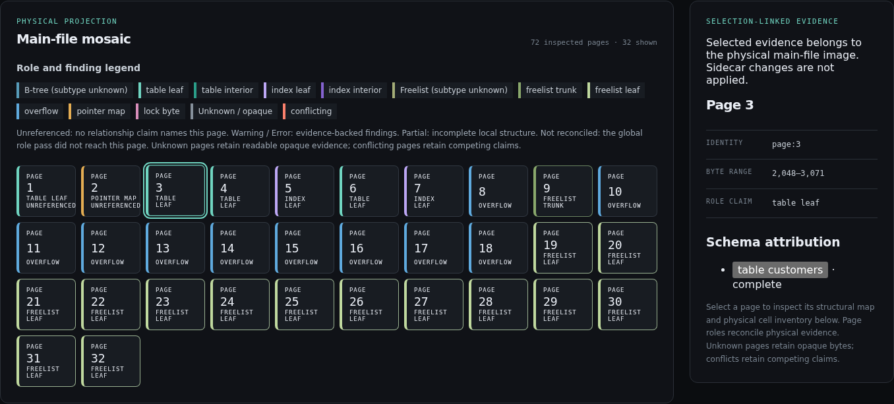
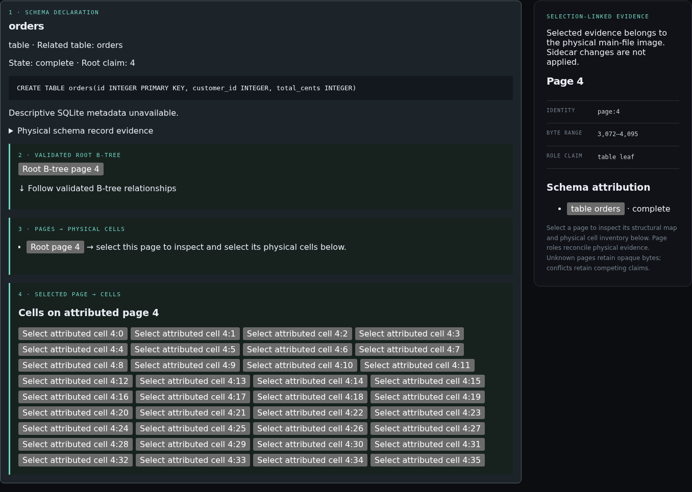

# Volmap SQLite Inspector

**See how your SQLite database is laid out on disk.**

Explore the pages behind your tables and indexes, follow B-tree and overflow
relationships, and inspect the structure of individual cells. Volmap is a
read-only tool for developers who want to understand SQLite internals or
investigate an unexpected storage layout.



The **Page atlas** connects a physical page map with page roles, byte ranges,
and the tables or indexes that use each page. Screenshots here show the bundled
catalog example running in the local web UI.

## Try it locally

From this checkout, use the [pinned build toolchain](release/README.md#pinned-build)
(Rust, Node.js, npm, and a C toolchain), plus Python 3 with SQLite support for the
sample database:

```sh
npm --prefix frontend ci
npm --prefix frontend run build
python3 examples/create_demo.py
cargo run --locked -- target/examples/catalog/database.sqlite
```

Open the **Page atlas URL printed in your terminal**. The web interface runs on
`127.0.0.1:3000` by default; stop it with Ctrl-C. If that port is busy, append
`--listen 127.0.0.1:0` to let the system choose an available port.

Already have a built executable? Open your own stopped database or stable copy:

```sh
./volmap-sqlite /path/to/frozen.sqlite
```

The executable includes the web interface, so you need only a browser at runtime.
The supported release target is Linux x86-64 with glibc 2.34 or newer. See
[release builds](release/README.md) to produce the standalone executable.

## Follow a table into its pages



**Schema flow** traces a table or index from its stored declaration to its root
B-tree and attributed pages. It gives you a path from a familiar schema name to
the physical structures that store it.

For a first tour of the catalog example:

1. In **Page atlas**, select a page to see its role, byte layout, and cells.
2. Switch to **Schema flow** and select **orders** to follow its storage path.
3. Select **documents**, then **Root B-tree page**, and select its cell. Choose
   **Deep-inspect selected cell** to decode that record and follow its overflow
   chain. Application values appear only after this explicit action; BLOBs show
   their type and length.

Prefer the terminal? Stop the web session and run:

```sh
cargo run --locked -- target/examples/catalog/database.sqlite --terminal
```

Press `q` to exit. The [example guide](examples/README.md) also includes WAL and
damaged-file examples with guided inspection steps.

## Choose a stable input

Use a stopped database or a stable copy of the main file and its adjacent
sidecars. Volmap inspects the **main-file image**: it reports WAL and rollback
journal files but does not apply their changes, so the inspected pages may differ
from the latest committed database state. Change detection cannot make a live
database safe to inspect.

Volmap provides structural diagnostics. It does not modify, repair, or recover
databases, and it has no SQL console.

## Documentation

- [Detailed usage and technical reference](docs/usage.md) — the original README,
  including inspection behavior, limits, APIs, and verification commands.
- [Guided examples](examples/README.md) — catalog, WAL, damaged files, and helper commands.
- [Release builds and verification](release/README.md) — prerequisites, reproducible builds, and checksums.
- [Domain glossary](CONTEXT.md) — the terminology used throughout the Inspector.
